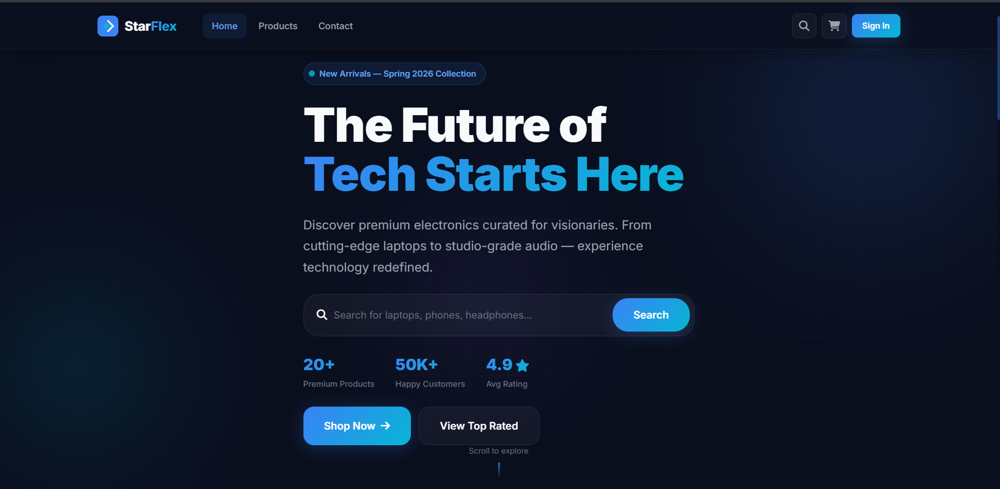
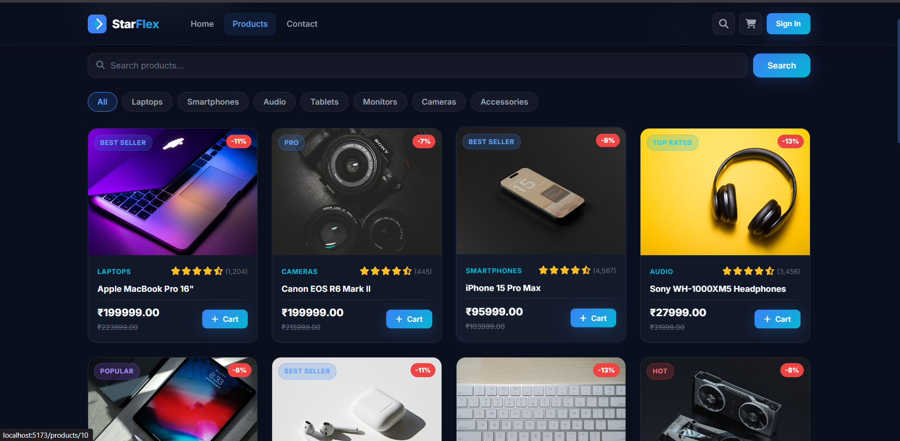
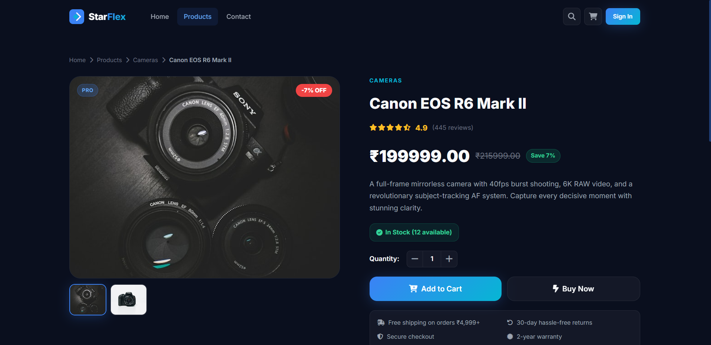
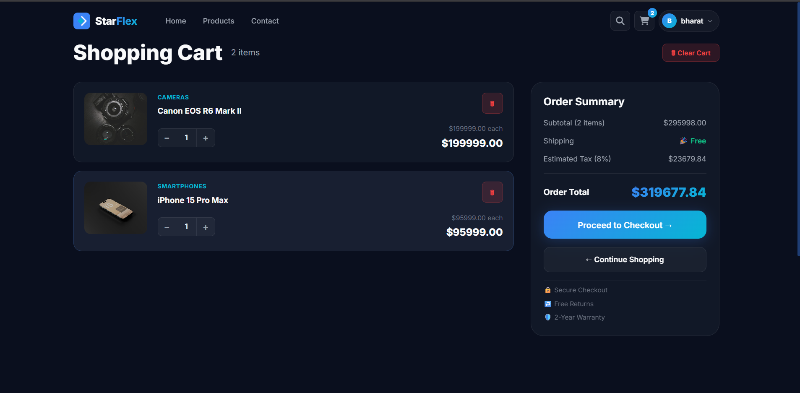
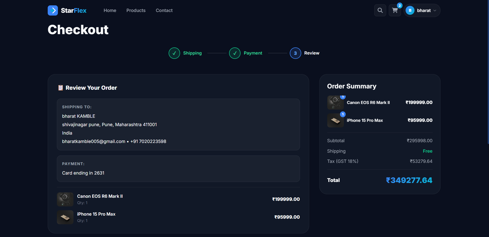
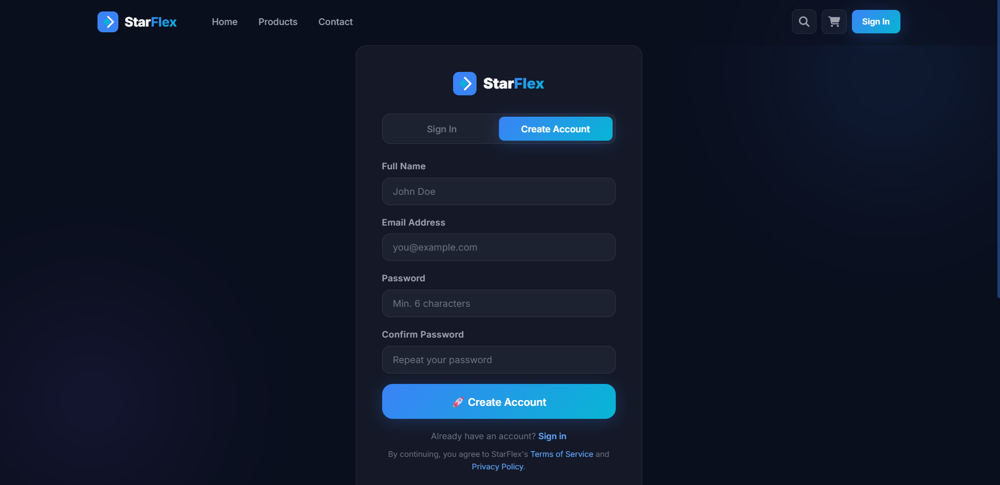
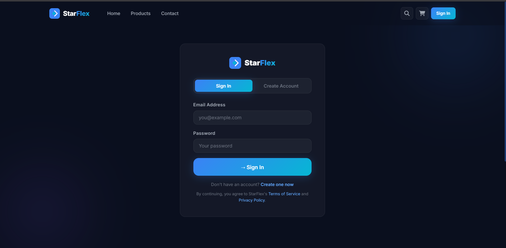
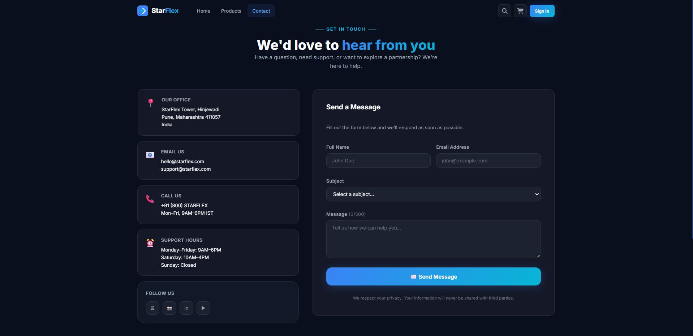

#  StarFlex Electronics


A modern full-stack e-commerce web application built using **React.js**, **Context API**, **Node.js**, and **Express.js**. The application provides a seamless shopping experience with user authentication, product browsing, shopping cart management, and checkout functionality.

---

## Features

- User Authentication (Login & Register)
- Product Listing
- Product Details Page
- Shopping Cart
- Checkout Flow
- Contact Page
- REST API Integration
- JSON-based Data Storage
- Fully Responsive Design

---

## Tech Stack

### Frontend

- React.js
- Context API
- JavaScript
- HTML5
- CSS3
- Vite

### Backend

- Node.js
- Express.js
- REST API

### Database

- JSON File Storage

---

## Project Structure

```text
StarFlex-Electronics
│
├── frontend/
│   ├── src/
│   ├── public/
│   └── package.json
│
├── backend/
│   ├── controllers/
│   ├── routes/
│   ├── middleware/
│   ├── data/
│   ├── server.js
│   └── package.json
│
└── README.md
```

---

## Screenshots

### Home Page



---

### Products Page



---

### Product Details



---

### Shopping Cart



---

### Checkout



---

### Register



---

### Sign Up



---

### Contact



---

## Installation

### Clone the repository

```bash
git clone https://github.com/Bharat7020/Starflex-electronics.git
```

### Frontend

```bash
cd frontend
npm install
npm run dev
```

### Backend

```bash
cd backend
npm install
npm start
```

---

## Future Improvements

- Payment Gateway Integration
- Wishlist Feature
- Product Search & Filters
- Admin Dashboard
- Order History
- Product Reviews
- MongoDB Database Integration

---

## Author

**Bharat Kamble**

- GitHub: https://github.com/Bharat7020
- LinkedIn: https://www.linkedin.com/in/bharat-kamble-89611b327

---

If you found this project helpful, consider giving it a star.